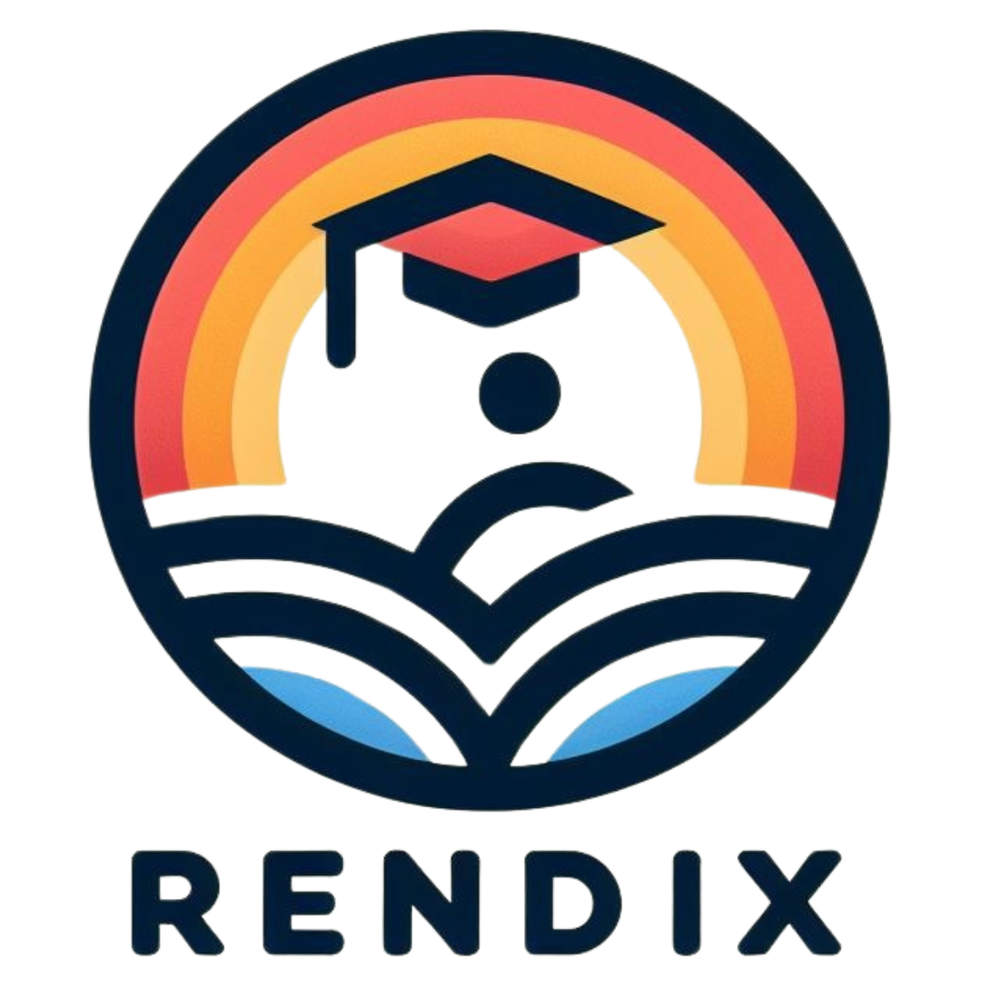

<!-- PROJECT LOGO -->
 
  

    <h1>Bienvenid@s a</h1>
    

  
 ¡La revolucionaria aplicación que transforma la <strong> experiencia educativa.!</strong>  
    Diseñada para estudiantes, profesores y padres, RENDIX es tu aliado perfecto para organizar y potenciar el aprendizaje.

###
<!-- ABOUT THE PROJECT -->

 
<h1> 

Acerca del Proyecto
</h1>
<h5>Con RENDIX, las tareas pendientes se vuelven claras y manejables.</h5>
<b>Estudiantes</b> Pueden chatear en tiempo real con tus compañeros y profesores, revisá tus calificaciones al instante y mantené un registro impecable de tus fechas clave en el calendario escolar.¡Todo lo que necesitás para triunfar, está al alcance de tu mano!
¡Todo lo que necesitás para triunfar, está al alcance de tu mano!
  
<b>Profesores,</b> RENDIX es su nueva herramienta de poder. Comunicados institucionales, chats interactivos con padres y alumnos, y un cronograma detallado que guía su día a día, cargue las notas con facilidad y acceda a un mundo de recursos para hacer de cada clase una experiencia memorable. ¡Preparen a sus alumnos para el éxito con RENDIX!
  
<b>Padres, </b>sigan el progreso académico de sus hijos como nunca antes. Con RENDIX, los informes en tiempo real y la comunicación directa con los docentes están a solo un clic, formen parte activa de la educación de sus hijos y celebren cada logro junto a ellos.
    

###
<h2 align="left">Front-end</h2>

  
  
  

###

<h2 align="left">Back-end</h2>

  
  
  
  
  

###

Figma del proyecto - Enlace -
https://www.figma.com/file/tmhKX8iK2akFhcQdjoIAw0/RENDIX%2FNo-country?type=design&node-id=0%3A1&mode=design&t=zFe54YYJ7VymMLVx-1

